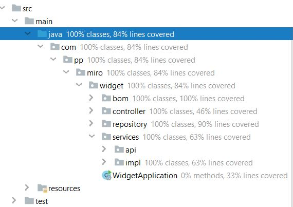

# Widgets
A REST API project for Miro Widget. The project is built with following:
* Java 8
* Build tool: Maven 3.2+
* Backend framework: Sprint-boot

## Howto's:

### Build the project: 

Build the project with mvn:
`mvn clean install`

### Launching the server:
Launch the server with following:
`mvn spring-boot:run`

The server is launch on 8080 port. Locally target on `http://localhost:8080`.

## REST API Exposed: 

OpenAPI available with the project. Once the server is launched you can use the swagger api target WS with following link: 
http://localhost:8080/api

Following rest APIs are exposed:

### To store a widget: 

#### Saving a new widget
POST api to save a new widget or update existing one. 
* An update is triggered if an ID is provided for the widget. 
* In case no widget exists in store for given ID, the ID is reset and a new widget is added.

`curl -d '{"xCoOrdinate":0,"yCoOrdinate":0,"widgetWidth":20,"widgetHeight":20}' -H "Content-Type: application/json" http://localhost:8080/widget`

#### update an existing one:
`curl -d '{"xCoOrdinate":0,"yCoOrdinate":0,"widgetWidth":20,"widgetHeight":20}' -H "Content-Type: application/json" http://localhost:8080/widget`

Sample Widget: 

`{"widgetId":"01766200-3ad5-4150-87da-b6312cd23b56","widgetWidth":20,"widgetHeight":20,"lastModificationDate":"2020-08-27T11:58:59.01","xcoOrdinate":0,"ycoOrdinate":0,"zindex":0}`

### To retreive a widget by ID: 
GET WS to retrieve a widget by ID.
`curl http://localhost:8080/widget/{id}`

### To retrieve all widgets:
GET WS to get all the widgets which exist in the store.
`curl http://localhost:8080/widget/all`

### To Delete a widget: 
DELETE WS to delete the widget with given ID.
`curl -X "DELETE" http://localhost:8080/widget/{id}`

## Test Coverage

Classes: 100% 
Lines: 78%

Full report screenshot below:

